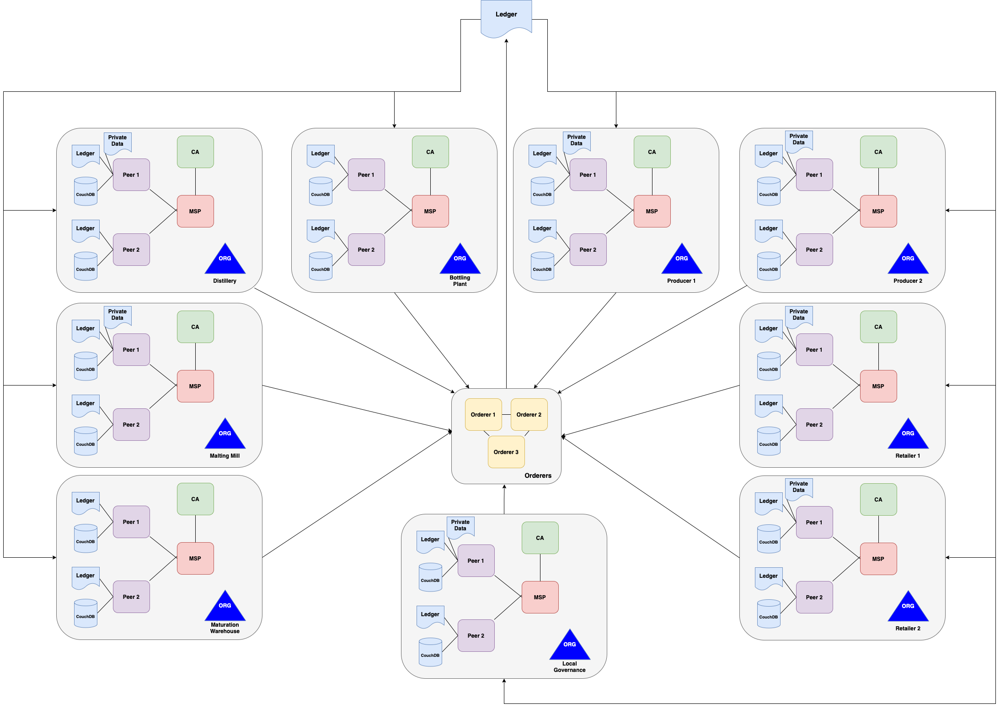

# SupplyFlow

This repository presents a modified version of the [Hyperledger Fabric](https://www.hyperledger.org/use/fabric) lab, [MiniFabric](https://github.com/hyperledger-labs/minifabric). MiniFabric is a script based tool written with [Ansible playbooks](https://docs.ansible.com/ansible/latest/user_guide/playbooks.html) for the automated processing of Hyperledger network nodes. Featuring a custom network configuration, modified parameters and a number of tool integrations this version creates a local Supplychain based Fabric network. 



# Features

In addition to [Caliper](https://hyperledger.github.io/caliper/v0.3.2/fabric-config/) and [Explorer](https://www.hyperledger.org/use/explorer) , this implementation features new integrations for the purpose of security testing.

- [Fabric Connector](https://github.com/splunk/fabric-logger) - Ledger Scraping for SIEM
- [Splunk](https://splunkbase.splunk.com/app/4605/?_gl=1*1bwkzvp*_ga*MTE3MTExNjUyMy4xNjYzMDc4MTkz*_gid*MzE3OTIxNjY1LjE2NjMwNzgxOTM.&_ga=2.28326270.317921665.1663078193-1171116523.1663078193#/details) - SIEM
- [Prometheus](https://prometheus.io/) - Fabric Metrics Collector
- [cAdvisor](https://github.com/google/cadvisor) - Host Metrics Collector
- [Collector-for-Docker](https://www.outcoldsolutions.com/docs/monitoring-docker/v5/installation/) - Docker Log Collector

# Perquisites

- Docker (18.4<)
- 10GB of disk space
- Unix based OS

# Getting Started

1. Clone the repository.
2. From within the repository, run the below:

```bash
./supplyflow up -o distillery.supply.com -c supplychain  -s couchdb -n supplyflow -r true
```

This will generate the network artefacts and launch the network depicted above in the figure. Alongside this network a custom chaincode is installed along with private data collections with set permissions.

1. From within the monitoring directory, run the below:

```bash
docker-compose up -d
```

This is command launches the monitoring tools where Splunk can be accessed at [https://localhost:8000](https://localhost:8000). Here the Hyperledger Fabric app will provide a holistic overview of all feeds from the testbed network.

To bring the network down:

```bash
./supplyflow down
```

To remove network containers and artefacts:

```bash
./supplyflow cleanup
```

This is recommended if having issues with the testbed. 

**Note: all data held within the network will be lost.**

# Contributions

This work utilises the available tools in the demonstration of a supplychain testbed in partial fulfilment of an honours research project. The testbed was implemented to provide performance and security testing data as part of the project.